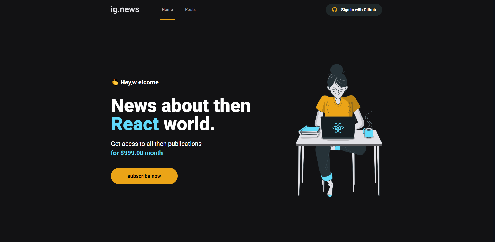

<h1 align="center">
  
</h1> 
<h1 align="center">
    ig.News - Next.js
</h1>
<p align="center">
 <a href="#sobre-o-projeto">Sobre o Projeto</a> •
 <a href="#tecnologias">Tecnologias</a> •
 <a href="#configurações-necessárias">Configurações necessárias</a> •
 <a href="#licença">Licença</a> •
 <a href="#autor">Autor</a>
</p>

## Sobre o projeto

O projeto tem como objetivo o estudo e desenvolvimento de uma aplicação em ReactJS com NextJS para listagem de posts e sistema de inscrição(subscription).

A aplicação foi desenvolvida utilizando o framework NextJS aplicando conceitos como consumo de API externas, API Root, Server Side Rendering (SSR), Static Site Generation (SSG), STRIPE para pagamentos das subscriptions, NextAuth para autenticação com Github, FaunaDB para armazenar as informações do usuário em um banco de dados e Prismic CMS para adição e gerenciamento do conteúdo dos posts.

O projeto foi desenvolvido como pratica das aulas do modulo 03 do [Ignite da Rocketseat](https://rocketseat.com.br/)

---
<div>
   
</div>
## Tecnologias

Abaixo as tecnologias utilizadas para construção da aplicação

- [ReactJS](https://reactjs.org/)
- [NextJS](https://nextjs.org/)
- [TypeScript](https://www.typescriptlang.org/)
- [SASS](https://sass-lang.com/)
- [Next-Auth](https://next-auth.js.org/)
- [Stripe](https://stripe.com/)
- [FaunaDB](https://fauna.com/)
- [Prismic CMS](https://prismic.io/)

---

## Configurações necessárias

### **Requisitos**

Necessário realizar as instalações:

- [Git](https://git-scm.com/)
- [Yarn](https://classic.yarnpkg.com)
- [Stripe CLI](https://stripe.com/docs/stripe-cli)

Criar conta e configurar os serviços externos:

- [Stripe](https://stripe.com/)
- [FaunaDB](https://fauna.com/)
- [Prismic CMS](https://prismic.io/)

*Configuração das variaveis de ambiente*
- Criar um arquivo na raiz do projeto com nome ".env.local"
- 
*Nome das variaveis*
*Stripe*
- STRIPE_API_KEY
- NEXT_PUBLIC_STRIPE_PUBLIC_KEY
- STRIPE_WEBHOOK_SECRET
- STRIPE_SUCCESS_URL 
- STRIPE_CANCEL_URL 

*GitHub*
- GITHUB_CLIENT_ID
- GITHUB_CLIENT_SECRET
 
*FaunaDb*
- FAUNADB_KEY
 
*JWT*
- SIGNING_KEY 

*Prismic CMS*
- PRISMIC_ENDPOINT
- PRISMIC_ACESS_TOKEN


### **Iniciando o projeto**

```bash
# Execute yarn para instalar as dependências
$ yarn

# Execute stripe listen para ouvir eventos do webhook
$ stripe listen --forward-to localhost:3000/api/webhooks 

# Para iniciar a aplicação
$ yarn dev

```
